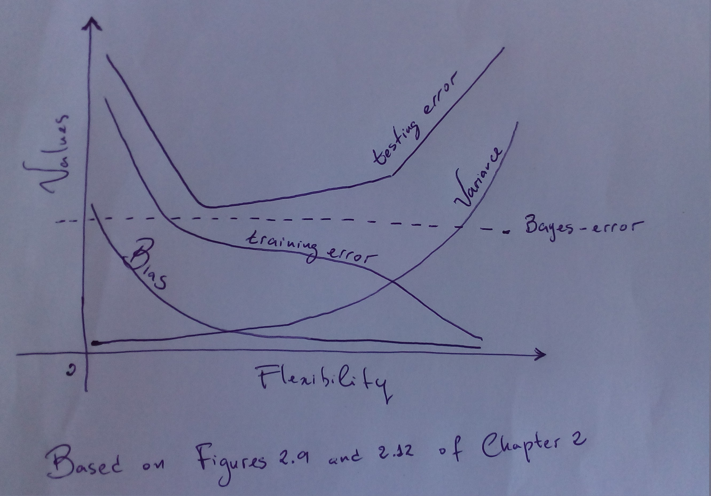

# Answers of Chapter 2 - Statistical Learning

## **Conceptual**

**1. For each of parts (a) through (d), indicate whether we would generally expect the performance of a flexible statistical learning method to be better or worse than an inflexible method. Justify your answer.**

a) The sample size n is extremely large, and the number of predictors p is small.

> Better - i think that a more flexible model can fit the data closer without overfit it because the extremely number of observations.

b) The number of predictors p is extremely large, and the number of observations n is small.

> Worse - with few data it's very prone to overfit the data.

c) The relationship between the predictors and response is highly non-linear.

> Better - more flexibility fits better non-linearity

d) The variance of the error terms, i.e. sigma^2=Var(e), is extremely high. 

> Worse - the flexible model will try to fit the noise/error-term. 

**2. Explain whether each scenario is a classification or regression problem, and indicate whether we are most interested in inference or prediction. Finally, provide n and p.**

a) We collect a set of data on the top 500 firms in the US. For each firm we record profit, number of employees, industry and the CEO salary. We are interested in understanding which factors affect CEO salary.

> Regression and Inference, *n* = 500 and *p* = 3 - Regression because it is a quantitative outcome, and Inference because the objective is not predict but interpretate the relalation between the factors and the salary. 

b) We are considering lauching a new product and wish to know whether it will be a success or a failure. We collect data on 20 similar products that were previously launched. For each product we have recorded whether it was a success or failure, price charged for the product, marketing budget, competition price, and the other variables.

> Classification and Prediction, *n* = 20 and *p* = 13 - It is a qualitative issue (binary one) and the main interest is get an accuracy response.

c) We are interesting in predicting the % change in the US dollar in relation to the weekly changes in the world stock markets. Hence we collect weekly data for all of 2012. For each week we record the % change in the dollar, the % change in the US market, the % change in the British Market, and the % change in the German market.

> Regression and Prediction, *n* = 52 and *p* = 3.

**3. We now revisit the bias-variance decomposition.**

a) Provide a sketch of typical (squared) bias, variance, training error, test error, and Bayes (or irreducible) error curves, on a single plot, as we go from less flexible statistical learning methods towards more flexible approaches. The x-axis should represent the amount of flexibility in the method, and the y-axis should represent the values for each curve. There should be five curves. Make sure to label each one.

b) Explain why each of the five curves has the shape displayed in part (a).

> * The *Bayes-error* is constant because it is particular from the dataset and does not alter by modelling features. 
> * The *training error* just decreases as the level of flexibility increases and the function overfits the data, at the end the error assumes a minimum constant value. 
> * The *test error* begins decreasing until a mark level where flexibility starts to overfit the training data (following its noise) and the error starts to increase.
> * The *Bias* just decreases as the levels of flexibility creates a more complex function, which represents better the real-problem. 
> * The *Variance* starts to increase slowly, after with higher levels of flexibility, the function become less robust and the variance value increases rapidly.

**4. You will now think of some real-life applications for statistical learning.**

a) Describe three real-life applications in which *classification* might be useful. Describe the response, as well as the predictors. Is the goal of each application inference or prediction? Explain your answer.

> - Predict how well physical exercises are been executed, classificating them between correct execution and commom mistakes, from sensors information in the arms, belts, forearms.
> 
> - Predict which flower is (example Iris dataset) from predictors as sepal and petal dimensions.
> 
> - Spam Detection, it is a two-class decision, the analyze checks the presence of keywords usually linked with Spam.

b) Describe three real-life applications in which *regression* might be useful. Describe the response, as well as the predictors. Is the goal of each application inference or prediction ? Explain your answer.

> - Predict house prices, predictors as: number of rooms, number of bathrooms, size, neighborhood.
> 
> - Understand the components of a good income, inference between salary (response) and  factors as years of education, field of study, age, years of work experience.
> 
> - Predict car values based on predictors as mileage, make, model, engine size, interior style and cruise control.

c) Describe three real-life applications in which cluster analysis might be useful.

> * A Hospital Care wants to open a series of emergency-care wards, so they can clusterize areas based on factor of maximum accident prone areas in a region.
>
> * Marketing, finding groups of customers with similar behavior from purchases past and searching tends.
>
> * Gene expression, it can distill the data down to a more comprehensible level by subdividing the genes into smaller number of categories and analyzing those. 

**5. What are the advantages and disadvantages of a very flexible (versus a less flexible) approach for regression or classification? Under what circumstances might a more flexible approach be preferred to a less flexible approach? When might a less flexible approach be preferred?**

> - Advantages: Yields less bias, represents more complex-systems and non-linear problems.
> - Disadvantages: Can overfits the training data, can have higher variance, harder to interpret.
>
> A more flexible approach is preferable when the system is underfitted, or when the data has non-linear characteristcs. A less flexible approach is preferable when the dataset has few observations, or when more interpretability is desirable, or when the data tends to a linear behavior.

**6. Describe the differences between a parametric and a non-parametric statistical learning approach. What are the advantages of a parametric approach to regression or classification (as opposed to a non-parametric approach)? What are its disavantages?**

> - Differences: Parametric approachs are model-based approach, where first we make an assumption about the functional form or shape of *f*, afterward it is done a procedure that uses the data set to train the model.  The non-parametric does not make assumptions about *f*.
> 
> - Advantages: Reduces the problem of estimating *f*. Instead of having to estimate an entirely arbitrary *p*-dimensional function *f*(X), it only needs to estimate *p*+1 coefficients.
>
> - Disavantages: The potencial disavantage is that model chosen will usually not match the true unknown form of *f*. It our model is too far from the true function, so our estimate will be very poor.

**7. The table below provides a training data set containing six observations, three predictors, and one qualitative response variable.**

> Obs. | X1 | X2 | X3 | Y
> --- | --- | --- | --- | ---
> 1 | 0 | 3 | 0 | Red
> 2 | 2 | 0 | 0 | Red
> 3 | 0 | 1 | 3 | Red
> 4 | 0 | 1 | 2 | Green
> 5 | -1 | 0 | 1 | Green
> 6 | 1 | 1 | 1 | Red

**Suppose we wish to use this data set to make a prediction for Y when X1=X2=X3=0 using K-nearest neighbors.**

a) Compute the Euclidean distance between each observation and the test point, X1=X2=X3=0

> The Euclidean distance between points **p** and **q** is the lenght of the line segment connecting them (pq).
> 
> 1. sqrt(3^2) = 3
> 2. sqrt(2^2) = 2
> 3. sqrt(1^2 + 3^2) = sqrt(10) = 3.16
> 4, sqrt(1^2 + 2^2) = sqrt(5) = 2.24
> 5. sqrt(1^2 + 1^2) = sqrt(2) = 1.41
> 6. sqrt(1^2 + 1^2 + 1^2) = sqrt(3) = 1.73

b) What is our prediction with K=1? Why?

> It is the class from the nearest neighbor - the observation 5 - Green.

c) What is our prediction with K=3? Why?

> It is the average from the three nearest neighbors - observations 5, 6 and 2 -, so it is Red. 

d) If the Bayes decision boundary in this problem is highly non-linear, then would we expect the best value for K to be large or small? Why?

> Small, because the level of flexibility is inversely proportional to the number of K for KNN approach, and to fit non-linear characteristcs is needed a high flexible approach.

 

